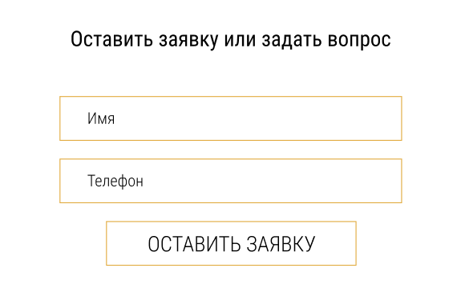
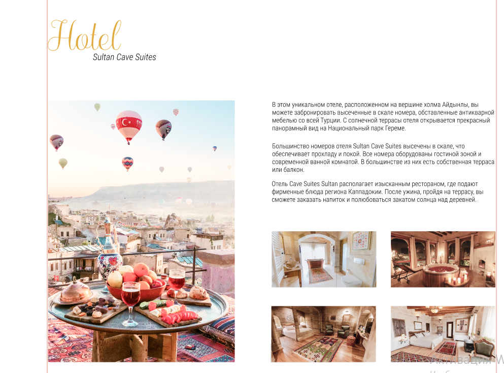
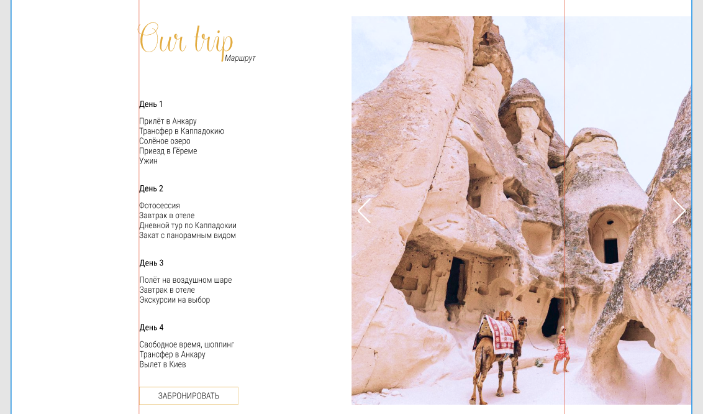

# Бэм
## Задание 1
head
head__ear
head__ear--size_big
body
body__abs
body__abs--amount_six
legs
legs--position_left
legs__knees

## Задание 2
### header

# header.header>(nav.header__nav.nav>ul.nav__list>(li.nav__item>a.nav__link)*3)+.header__phone.phone>img.phone__img+a.phone__number

### form 

# form.form>h2.form__title+input.form__input*2+button.form__submit

### card

# li.card>h3.card__title+p.card__subtitle+div.card__grid-big>img.card__img.card__img--big+p.card__text+.card__grid-small>img.card__img.card__img--small*4

### our-trip-section

# section.trip>(h2.trip__title+p.trip__subtitle+ul.trip__calendar.calendar>(li.calendar__day>h3.calendar__title+p.calendar__p)*4)+img.trip__img

